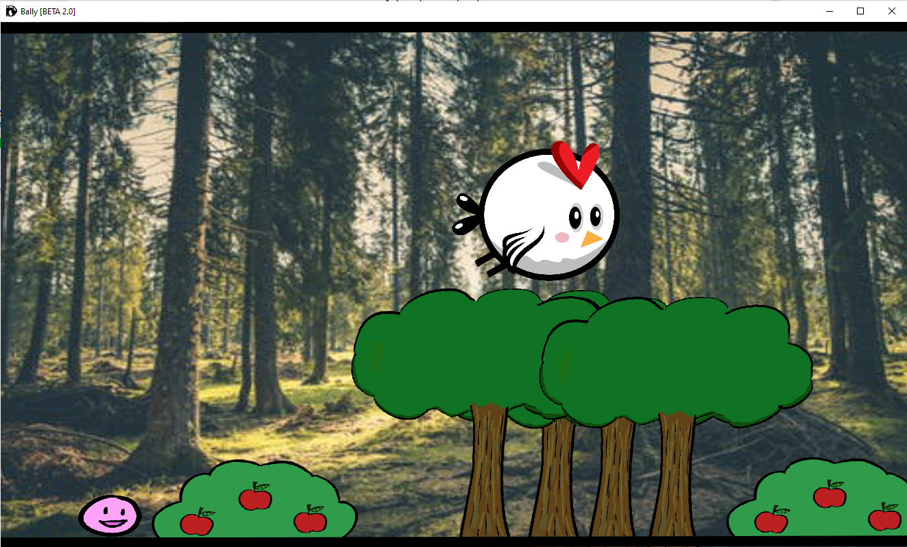

# Bally Version 2

While cleaning up my computer for additional space, I came across an old project that I've worked on in 2017.

I had like a 1-week break and decided to make a game in C# using the Unity game engine. The result is an unfinished (and probably never going to be finished game) with some custom BGM I've made using [Bosca Ceoil](https://boscaceoil.net/).

Why... you ask? 

Well I've probably watched one too many game dev videos back then ..

## Running the game(?)

The game should still be playable if anyone is interested in trying lol. 

There is an EXE file located at -> `BallyV2\Build\Window\x64 version 2\BALLY\Bally [BETA 2.0].exe`

Click on it and it **_should_** run.

## Contributing

Dead project, as of now and probably forever.

## License
[MIT](./LICENSE.md)
